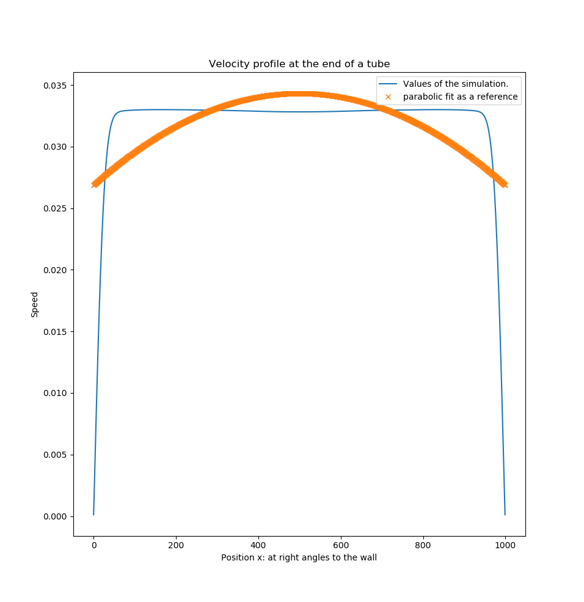

#####################
hier kommen tests hin
#####################

Unit tests
==========

System test
===========
The complete system is tested by the well-known scenario: flow in the pipe.
The analytical solution  of the velocity is a parabolic velocity profile.
The test can be started like a normal simulation via the json file "system_test.json".
On the basis of the name of the json files, kaLB recognizes the system test
and carries out the evaluation after the simulation:

>>> $ pwd
>>> /home/LBM_for_Fluid_Simulations/example
>>> $ python ../src/kaLB.py -i system_test.json

It is very easy to change the system_test.json so that the test fails.
The analysis is started default after 1000 time steps,
therefore one can change the system for example to 100x100 lattice point.
which fails because the fluid does not have enough time to build up its expected current profile.
All settings can be made via the system_test.json.
The analysis always starts after the simulation and evaluates the speed field from the hdf5 file
to the last saved time on the last row in the tube.
The scenario is constructed in such a way that a liquid flows in on the left side,
walls are defined at the top and bottom and the right side allows outflow.

The following example shows:

.. code-block:: json

    {
        "time steps": 2000,
        "lattice points x": 500,
        "lattice points y": 1000,
        "tau": 400
    }

The test fails, it does not set the desired profile, is due to the fact that the tube is too thick for its length
[lattice points x] vs. [lattice points y]. Even after more time steps, no parabolic flow profile will occur.

